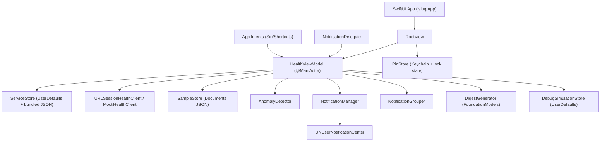

# isitup Technical Architecture Document

## 1. System Overview

`isitup` is a SwiftUI iOS application for endpoint health monitoring with:

- Concurrent HTTP checks (`HEAD` with `GET` fallback)
- Stateful service health tracking (`unknown`, `checking`, `healthy`, `degrading`, `down`, `error`)
- Persistent sample history per service
- Keychain-backed PIN security
- Local notification pipeline with cooldowns and grouping
- App Intents + Siri shortcuts for on-demand checks
- On-device daily digest generation through Apple Foundation Models (when available)

Primary app entrypoint:

- `/Users/preyashyadav/Desktop/isitup/isitup/App/isitupApp.swift`

Primary orchestration layer:

- `/Users/preyashyadav/Desktop/isitup/isitup/ViewModels/HealthViewModel.swift`

---

## 2. Runtime Architecture

Key directional flow:

1. Services are loaded from persisted config (or bundled defaults).
2. `HealthViewModel.checkAll()` runs checks concurrently.
3. Each check records sample data and updates service state.
4. `AnomalyDetector` can promote `healthy -> degrading`.
5. `NotificationManager` handles cooldown-governed notifications.
6. Digest generation reads service/sample snapshots for AI summarization.

---

## 3. Frameworks Used

### Core
- `Foundation`
- `SwiftUI`

### Networking
- `URLSession` (via `Foundation`)

### Persistence/Security
- `UserDefaults`
- `Security` (Keychain APIs: `SecItemCopyMatching`, `SecItemAdd`, `SecItemUpdate`, `SecItemDelete`)

### Notifications
- `UserNotifications` (`UNUserNotificationCenter`, categories, actions, local requests)

### Siri/Shortcuts
- `AppIntents`

### Charts/UI analytics
- `Charts`

### Apple Intelligence (conditional)
- `FoundationModels` (`LanguageModelSession`, `SystemLanguageModel`)

### Concurrency model
- Swift Concurrency (`async/await`, `Task`, `TaskGroup`)
- `@MainActor` isolation on `HealthViewModel`

---

## 4. Data Model

Defined in:

- `/Users/preyashyadav/Desktop/isitup/isitup/Models/Models.swift`

### `HealthState`
- `unknown`
- `checking`
- `healthy`
- `degrading`
- `down`
- `error`

### `ServiceConfig`
Persisted service metadata:
- `id: String` (UUID string, normalized)
- `name: String`
- `url: String`

### `ServiceStatus`
Runtime service state:
- `id: UUID`
- `name: String`
- `endpoint: URL?`
- `state: HealthState`
- `lastCheckedAt: Date?`
- `message: String?`
- `samples: [CheckSample]`

### `CheckSample`
Time-series sample:
- `at: Date`
- `state: HealthState`
- `statusCode: Int?`
- `responseTimeMs: Int?`
- `message: String?`
- `isSimulated: Bool?`

---

## 5. Configuration + Persistence Layers

## 5.1 Service Configuration Store
File:

- `/Users/preyashyadav/Desktop/isitup/isitup/Services/ServiceStore.swift`

Behavior:
- Loads from `UserDefaults` key: `isitup.services.config`
- If missing, loads bundled defaults from:
  - `/Users/preyashyadav/Desktop/isitup/isitup/Resources/services.json`
- Normalizes IDs:
  - trims whitespace
  - ensures valid UUID
  - ensures uniqueness
  - regenerates invalid/duplicate IDs

## 5.2 Sample Store (history persistence)
File:

- `/Users/preyashyadav/Desktop/isitup/isitup/Services/SampleStore.swift`

Storage:
- JSON file in Documents directory:
  - `isitup.samples.json`
- Per-service dictionary:
  - key = service UUID string
  - value = `[StoredSample]`

Persisted sample fields:
- timestamp (`at`)
- response time (`responseTimeMs`)
- status (`HealthState`)
- simulated flag (`isSimulated`)

Retention:
- Max 200 samples per service (rolling window)

## 5.3 Debug Simulation Store
File:

- `/Users/preyashyadav/Desktop/isitup/isitup/Services/DebugSimulationStore.swift`

Keys:
- `isitup.debug.simulation.enabled`
- `isitup.debug.simulation.additionalLatencyMs`

Special behavior:
- On load, simulation is forced disabled (`isEnabled = false`) to avoid stale test state after relaunch.

## 5.4 Notification Cooldown Persistence
File:

- `/Users/preyashyadav/Desktop/isitup/isitup/Services/NotificationManager.swift`

In-memory map:
- `lastNotified: [String: Date]`

Persisted key scheme:
- `isitup.lastNotified.<cooldownKey>`

Examples:
- per service down/error: `isitup.lastNotified.<serviceID>`
- per service degrading: `isitup.lastNotified.<serviceID>.degrading`
- grouped outage: `isitup.lastNotified.groupedOutage`
- grouped degrading: `isitup.lastNotified.groupedDegrading`

## 5.5 PIN Security Store
File:

- `/Users/preyashyadav/Desktop/isitup/isitup/Services/PinStore.swift`

PIN storage:
- Keychain `kSecClassGenericPassword`
- Service: `com.isitup.pin`
- Account: `default`

Non-secret lock state:
- `UserDefaults` key `isitup.unlocked`

Legacy migration:
- Moves old UserDefaults PIN key `isitup.pin` into Keychain if needed.

## 5.6 Digest Cache
File:

- `/Users/preyashyadav/Desktop/isitup/isitup/ViewModels/HealthViewModel.swift`

Keys:
- `isitup.digest.text`
- `isitup.digest.generatedAt`

---

## 6. Health Check Execution Pipeline

Core orchestration file:

- `/Users/preyashyadav/Desktop/isitup/isitup/ViewModels/HealthViewModel.swift`

Network client:

- `/Users/preyashyadav/Desktop/isitup/isitup/Services/HealthClient.swift`

## 6.1 Per-Service check flow

`runCheck(serviceId:emitDownNotificationImmediately:)`:

1. Resolve service index.
2. Set state to `checking`, clear message.
3. Inject artificial sleep if debug simulation enabled.
4. Execute HTTP check.
5. Map status code:
   - `200...399` => `healthy`
   - otherwise => `down`
6. Append simulation hint to message (`+<N>ms simulated`) when relevant.
7. Append sample (`responseTimeMs = networkMs + simulatedMs`).
8. Run anomaly detector; may promote to `degrading`.
9. Emit notifications depending on mode.

Error path:
- On request failure: state `error`, capture localized error message, append sample with `responseTimeMs = nil`.

## 6.2 Network probing strategy

`URLSessionHealthClient.check(url:)`:

- First request: `HEAD` with 5s timeout
- Fallback on failure: `GET` with 5s timeout
- Response time measured with `DispatchTime.now().uptimeNanoseconds`

## 6.3 Concurrent batch checks

`checkAll()` uses `withTaskGroup`:

- Spawns one task per service
- Collects transition outcomes:
  - transitioned to failure (`down`/`error`)
  - transitioned to degrading
- Performs grouped notification decision after all checks complete
- Donates `CheckAllServicesIntent` usage signal to Shortcuts

---

## 7. Anomaly Detection (Technical Detail)

File:

- `/Users/preyashyadav/Desktop/isitup/isitup/Services/AnomalyDetector.swift`

Output domain:
- `unknown`
- `stable`
- `degrading`

Default parameters:
- `minimumSamples = 10`
- `rollingWindowSize = 50`
- `thresholdMultiplier = 2.5`
- `simulatedFallbackDegradingMs = 1800`

Input filtering:
- Uses only samples whose states are `healthy` or `degrading`
- Ignores entries without `responseTimeMs`
- Computes `isSimulated` from:
  - explicit sample flag
  - or message containing `"simulated"`

## 7.1 Baseline and threshold math

For recent points:

- `recent = suffix(rollingWindowSize)`
- `latest = recent.last`
- `previous = recent.dropLast()`

If `latest.isSimulated`:
- Baseline uses only non-simulated `previous` points.

If there is no non-sim baseline:
- Fallback rule applies: `latest.latency >= 1800ms => degrading`, else `unknown`.

Statistical computation:

- `mean = sum(baseline) / n`
- `variance = sum((x - mean)^2) / n`
- `stddev = sqrt(variance)`

Thresholds:

- `stdThreshold = mean + (2.5 * stddev)`
- `simulatedAbsoluteThreshold = mean + 500`

Decision:

- `degrading` if:
  - `latest > stdThreshold`, OR
  - sample is simulated AND `latest > simulatedAbsoluteThreshold`
- else `stable`

Insufficient data:
- non-simulated paths under 10 points -> `unknown`
- simulated paths under 10 points can still be marked degrading via absolute fallback

Integration behavior:
- Degrading is only applied when current state is `healthy`.
- Message is augmented with `Latency degrading`.

---

## 8. Notification Architecture

Files:

- `/Users/preyashyadav/Desktop/isitup/isitup/Services/NotificationManager.swift`
- `/Users/preyashyadav/Desktop/isitup/isitup/Services/NotificationGrouper.swift`
- `/Users/preyashyadav/Desktop/isitup/isitup/Services/NotificationDelegate.swift`
- `/Users/preyashyadav/Desktop/isitup/isitup/Views/RootView.swift`

## 8.1 Categories/actions

Registered categories:
- `SERVICE_DOWN`
- `GROUP_OUTAGE`

Actions:
- `OPEN_APP` (foreground)
- `CHECK_NOW` (foreground, grouped category)

## 8.2 Cooldown policy

Cooldown:
- 60 seconds per cooldown key

Applies to:
- individual down/error
- individual degrading
- grouped outage
- grouped degrading

## 8.3 Grouping policy

`NotificationGrouper.decide`:
- grouped if count of newly impacted services >= 2

Used for:
- newly failed services in `checkAll`
- newly degrading services in `checkAll`

## 8.4 Check Now action integration

When user taps `CHECK_NOW`:
- `NotificationDelegate` posts `NotificationManager.checkNowRequestedNotification`
- `RootView` receives it and triggers `vm.checkAll()`

---

## 9. Siri / App Intents Integration

File:

- `/Users/preyashyadav/Desktop/isitup/isitup/Intents/ServiceIntents.swift`

Startup refresh:

- `/Users/preyashyadav/Desktop/isitup/isitup/App/isitupApp.swift`

## 9.1 `CheckAllServicesIntent`
- Availability: iOS 17.2+
- `openAppWhenRun = false`
- Calls `HealthViewModel.checkAll()`
- Returns both value + dialog summary

## 9.2 `CheckServiceIntent`
- Availability: iOS 16.0+
- Parameter:
  - `serviceName: String`
  - prompt: `"Which service?"`
- `openAppWhenRun = false`
- Resolves best matching service, executes single check, returns status text

Matching strategy order:
1. exact normalized name
2. exact normalized host
3. partial normalized name
4. partial normalized host

Normalization:
- lowercase
- trim whitespace
- replace non-alphanumeric chars with spaces (regex)

## 9.3 App shortcuts

Shortcuts provider:
- `ServiceShortcutsProvider` (iOS 17.2+)

Example phrases:
- `"Check my services in <app>"`
- `"Check service in <app>"`
- `"Ask <app> to check a service"`

## 9.4 Donation

After `checkAll()` completion:
- Donates `CheckAllServicesIntent` (`try await donate()`)

---

## 10. Apple Intelligence Daily Digest

File:

- `/Users/preyashyadav/Desktop/isitup/isitup/Services/DigestGenerator.swift`

ViewModel integration:

- `/Users/preyashyadav/Desktop/isitup/isitup/ViewModels/HealthViewModel.swift`

UI card:

- `/Users/preyashyadav/Desktop/isitup/isitup/Views/MonitorView.swift`

## 10.1 Availability gating

Digest enabled only when all are true:
- `FoundationModels` can be imported
- Runtime is iOS 26.0+
- `SystemLanguageModel.default.isAvailable == true`

Otherwise:
- feature hidden/disabled (`nil` digest)

## 10.2 Prompt construction

For last 24h per service:
- current status
- average latency
- latest latency
- trend label (increasing/decreasing/stable via rolling window comparison)
- outage count (down/error transition count)

Prompt constraints:
- if services > 20, include only first 20 lines + hidden service summary

Correlation section:
- detects outage transitions clustered by 5-minute buckets
- includes multi-service correlated failure lines

## 10.3 Inference execution

Model call:
- `LanguageModelSession(model: .default).respond(to: prompt)`

Output policy:
- trims whitespace
- returns `nil` on errors/empty output

## 10.4 Caching policy

Daily cache in `HealthViewModel`:
- generated text and timestamp persisted to UserDefaults
- auto-refresh skipped when already generated same day unless forced

---

## 11. UI Composition

## 11.1 Root-level navigation
File:
- `/Users/preyashyadav/Desktop/isitup/isitup/Views/RootView.swift`

Tabs:
- `MonitorView`
- `DashboardView`

PIN lock gate:
- If PIN exists and not unlocked, show `PinLockView`
- Locks automatically when app leaves active scene phase

## 11.2 Monitor tab
File:
- `/Users/preyashyadav/Desktop/isitup/isitup/Views/MonitorView.swift`

Contains:
- Daily Digest card (conditional)
- Overview Summary card
- Service list + detail navigation
- `Check All` toolbar action

## 11.3 Service detail
File:
- `/Users/preyashyadav/Desktop/isitup/isitup/Views/ServiceDetailView.swift`

Shows:
- endpoint
- last checked time
- healthy sample counts
- non-simulated baseline count
- latest latency
- current message
- per-service `Check Now` action

## 11.4 Settings
File:
- `/Users/preyashyadav/Desktop/isitup/isitup/Views/ServicesSettingsView.swift`

Sections:
- Service Management (add/edit/delete/reset/save)
- Notifications
- Security (PIN set/change/remove/lock)
- History (clear samples + digest cache)
- Developer Tools (debug latency simulation, debug builds)

---

## 12. Security Notes

1. PIN secret is no longer stored in plaintext UserDefaults; it is stored in Keychain.
2. Unlock state remains in UserDefaults for session UX (`isitup.unlocked`), not as a secret.
3. Keychain errors fail safely to locked state.

---

## 13. Default Service Seed

Bundled service definitions:

- `/Users/preyashyadav/Desktop/isitup/isitup/Resources/services.json`

Current seed entries include:
- Portfolio
- DesignIt
- Spidey's Arcade
- PicMeal
- IoTHINC VITC

---

## 14. Dependency Injection + Testability Hooks

`HealthViewModel` initializer accepts injectable dependencies:

- `ServiceStore`
- `SampleStoring`
- `AnomalyDetecting`
- `DigestGenerating`
- `DebugSimulationStoring`
- `NotificationGrouping`
- `UserDefaults`
- `NotificationManager`
- plus `useMock` to switch between real and mock network clients

This allows deterministic unit tests for:
- state transitions
- anomaly classification behavior
- persistence and cooldown semantics
- notification grouping logic

---

## 15. Operational Notes / Known Behavior

1. Some simulator environments may show CoreSimulator runtime errors unrelated to app logic.
2. Siri/Shortcuts phrase updates may require shortcut re-registration after intent changes.
3. Digest generation silently no-ops when Apple Intelligence is unavailable or inference fails.
4. Degrading classification is intentionally conservative for non-simulated traffic but more responsive in simulated-latency mode.

